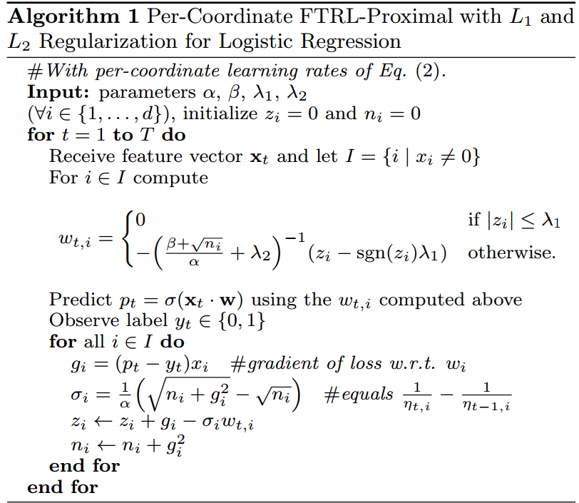

# Follow the (Proximal) Regularized Leader
В данном репозитории находится реализация алгоритма FTRL-Proximal с покординатными learning rates для обучения логистической регрессии. Алгоритм был  описан в статье [McMahan H.B. et al. "Ad click prediction: a view from the trenches"](http://static.googleusercontent.com/media/research.google.com/en//pubs/archive/41159.pdf)

FTRL-Proximal (далее FTRL) является онлайн-алгоритмом.

Преимущество FTRL перед OGD (онлайновый градиентный спуск, который довольно эффективен при решении обобщенных задач линейной регрессии) заключается в следующем.

На сильно разреженных данных число весов близких к 0 довольно велико, FTRL может занулять их и экономить память при хранении модели. OGD, в свою очередь,  даже при использовании L1-регуляризации (которая служит для зануления весов у неинформативных фичей) не загонит веса в точный 0 и будет хранить огромный ненулевой вектор.

Градиентный спуск c покординатными learning rates лучше, чем алгоритм с глобальной (одинаковой для всех фич) learning rate, так как для признаков, которые у элементов выборки встречаются часто, learning rate уменьшается быстрее, чем для редких признаков.

Алгорит FTRL с покординатным learning rate и L1, L2 регуляризациями выглядит следующим образом

### Данные

В данном проекте мы работаем с выборкой, где каждому сэмплу (рекламному объявлению) соответствует метка клик/не клик, id объявления и 22 признака (это выборка соревнования [Click-Through Rate Prediction](https://www.kaggle.com/c/avazu-ctr-prediction/data) на kaggle ).

### Предобработка

Сначала каждому объекту сопоствили вектор строк _(...,fiName\_fiValue,...)_, _i=1,..,22_. 

Затем, с помощью хэширования преобразовали вектор строк в вектор чисел _(...,hashi,..)_ и сопоставили каждому объекту вектор размера _size = 2power_, где _size_ - число ключей в хэш-таблице, а на месте с номером _hashi_ стоит _1_.

### Реализация
Реализация выполнена на C++ и находится в файле `ftrl.cpp` (внутри имеются описания создаваемых структу, классов, функций).

Имеются классы:

   **FtrlProximal** - обучатор логистической регрессии с L1, L2 регуляризацией и покординатными learning rates,
   **FtrlProximal_approx** - обучатор логистической регрессии с L1, L2 регуляризацией и покординатными learning rates, в котором сумма квадратов градиентов _ni_ для фичи _i_ аппроксимируемся с помощью [функции](http://www.sciweavers.org/download/Tex2Img_1495724778.jpg), зависящей  от _(N, P)_, 
где  _N_(или _P_) - число объектов с признаком _i_, имеющие негативную метку:не клик (или положительную: клик)

Теоретической обоснование данной аппроксимации приведено в упомянутой выше статье. Алгоритм с аппроксимацией дает практически такое же качество, как и алгоритм без нее. Более того, при запуске нескольких похожих моделей позволяет не пересчитывать каждый раз  суммы квадратов градиентов ni, а воспользоваться один раз посчитанными счетчиками меток классов.
    

### Компиляция

    g++  -std=c++11  ftrl.cpp  -o  ftrl
    
Программа берет на вход файл с параметрами алгоритма FTRL (`params.cfg`), файлы с тренировочной (`train.split.csv`) и тестовой (`test.split.csv`) выборками и записывает в указанный файл (`result.txt`) предсказания модели.

    
### Запуск

    ./ftrl  params.cfg  train.split.csv  test.split.csv  result.txt
    
В файле params.txt можно задать следующие параметры:

    L1, L2 - коэффициенты регулярицации,  
    alpha, beta - параметры алгоритма, 
    size - размер хэш-таблицы (должен быть степенью 2),
    is_approx - равен 1, если используем обучатор FtrlProximal_approx и  0, если FtrlProximal,
    holdout_period:  на каждом holdout_period по счету объекте из тренировочного файла считаем validation loss.

В файле `logs.txt` отображается  процесс работы программы (содержит запись всех запусков).

В файл `errors.txt` выводится информация об ошибках.

В файл `val_loss.txt` записываются значения функции потерь на валидационных данных.
